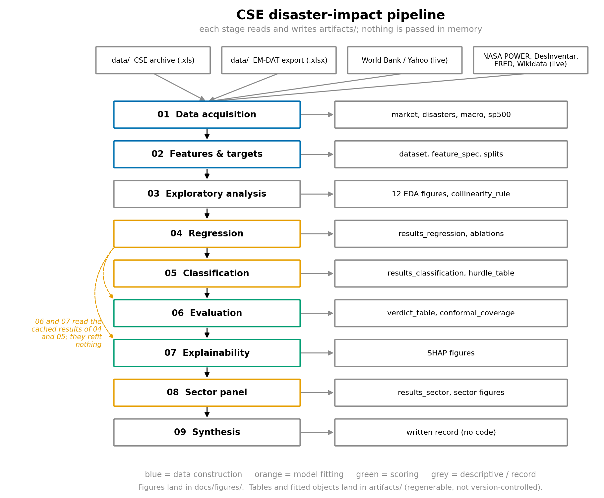

# Architecture

How this project is put together, and why each piece exists. Start here; the detailed
documents are listed at the bottom.

Written for a reader who knows basic Python and introductory machine learning. Where a
specialised term is unavoidable it is explained on first use.



*(Regenerate with `python scripts/make_architecture_diagram.py`.)*

## 1. What the system does

It takes two kinds of raw input — a decade-plus archive of Colombo Stock Exchange
trading files, and EM-DAT's record of natural disasters in Sri Lanka — and produces one
table with **one row per disaster**. Each row holds what was knowable before the event
and what the market did afterwards. Models are then fitted on the early events and
scored on the later ones.

The important framing: this is an **ex-post impact-attribution** study, not an
early-warning system. Several features are damage assessments finalised weeks or months
after an event, so the model cannot be run the day before a disaster. It answers *given
a disaster of known severity, what was the market's response*, not *what will
tomorrow's disaster do*.

## 2. The shape of the pipeline

Nine notebook stages run in order. **No stage passes data to the next in memory.** Each
one reads what it needs from `artifacts/` and writes what it produces back there.

That design is not decoration. Stage 01 parses two dozen Excel workbooks and hits four
live web sources; stages 03, 06 and 09 need none of that. Caching between stages turns
a figure tweak from a full re-run into a few seconds of work. It also closes a
reproducibility hole: because the live sources are unpinned and can return revised
numbers months later, every cached file is written with a `.provenance.json` sidecar
recording the retrieval time and the version of every library involved.

| Stage | Notebook | Reads | Writes | Cost |
|---|---|---|---|---|
| 01 | `01_data_acquisition.ipynb` | `data/`, live APIs | `market`, `disasters`, `macro`, `sp500` | **slow** |
| 02 | `02_features_targets.ipynb` | stage 01 output | `dataset`, `market_feats`, `in_scope`, `feature_spec`, `splits` | fast |
| 03 | `03_eda_diagnostics.ipynb` | `dataset` | 12 EDA figures, `collinearity_rule` | fast, fits nothing |
| 04 | `04_modeling_regression.ipynb` | `dataset`, `splits` | `results_regression`, `results_ablations`, `selected_features`, `train_fit_r2` | **slow** |
| 05 | `05_modeling_classification.ipynb` | `dataset`, `splits` | `results_classification`, `classification_summary`, `hurdle_table` | medium |
| 06 | `06_evaluation.ipynb` | stages 04 and 05 | `verdict_table`, `conformal_coverage`, figures | fast, refits nothing |
| 07 | `07_explainability.ipynb` | `final_rf_models` | SHAP figures | medium |
| 08 | `08_sector_panel.ipynb` | `dataset`, sector workbook | `results_sector`, `sector_*` tables, figures | slow |
| 09 | `09_synthesis.ipynb` | every table above | written record only | instant |

Four standalone scripts run **after** the nine stages and read only their cached outputs:

| Script | Reads | Writes | Cost |
|---|---|---|---|
| `scripts/freeze_baseline.py` | every cached artifact | `frozen_baseline.json` — the Y2 regression baseline | instant |
| `scripts/run_y1_improvement.py` | `dataset`, `market`, `market_feats`, `feature_spec` | `y1_improve_*` (240-configuration grid) | **~75 min** |
| `scripts/run_y3_improvement.py` | `dataset`, `feature_spec` | `y3_improve_*` (censoring-aware survival grid) | ~1 min |
| `scripts/build_final_tables.py` | the two grids above | `docs/thesis_materials/final_table_*.csv` | instant |

They are deliberately additive: none of them writes an artifact the nine stages read, which
is what makes the Y2 freeze (`tests/test_y2_frozen.py`) hold by construction rather than by
care. The Y1 horizon targets they need are rebuilt in memory from `market.parquet`
(`src/evaluation/y1_horizons.py`) rather than by regenerating `dataset.parquet`.

Stages 06 and 07 fit nothing. They read cached out-of-fold predictions, which is what
makes it possible to re-derive a figure or add a test without re-running an hour of
model fitting — and what makes it impossible to accidentally tune a model while
"re-plotting" it.

## 3. Where code lives

Notebooks are the narrative. Reusable logic lives in `src/` and is covered by tests
that need neither a data file nor a notebook run.

```
src/
  data_pipeline/
    cse_raw_loaders.py     the three incompatible Excel layouts, ASPI, sector indices
    emdat_loader.py         EM-DAT schema mapping, date precision, damage provenance
    macro_loader.py         World Bank annual series, S&P 500 daily returns
    external_sources.py    NASA POWER, DesInventar, FRED FX, Wikidata elections
    feature_eng.py          features, the scope filter, and all five targets
    preprocessor.py         chronology-safe fills and window truncation
    sector_panel.py         (event, sector) panel + event-grouped folds and bootstrap
  sampling/
    time_aware_smogn.py     synthetic minority events, training folds only
  training/
    walk_forward.py         rolling chronological train/test splits
  models/
    classifiers.py          the six pre-registered labels and their metrics
    hurdle.py                two-stage model for the censored recovery target
    shallow_mlp.py           multi-task network, one head per target
    mlp_subprocess_runner.py   trains it in a clean process (Windows torch workaround)
  evaluation/
    metrics.py               pooling, bootstrap and conformal intervals
    verification.py          paired bootstrap and Diebold-Mariano baseline tests
    collinearity.py          correlation, VIF, and the pre-declared redundancy rule
    y1_horizons.py           the four Y1 event-window horizons and the market/disaster split
    survival_metrics.py      C-index, IPCW Brier score, recovery-probability calibration
    figures.py                the evaluation figure suite and the thesis style
    eda_figures.py            the exploratory figure suite
```

`notebooks/_shared.py` owns the three things that would otherwise be re-declared in
nine places and drift apart: where files live, how the artifact cache is read and
written, and the target definitions. Every notebook opens with `from _shared import *`.

## 4. Data flow in one paragraph

Raw Excel and EM-DAT rows become four cached tables (stage 01). Those become one
event-level table of features and five targets, plus a fixed list of chronological
folds (stage 02). The table is described but not modified (stage 03). Models are fitted
fold by fold and every out-of-fold prediction is cached (stages 04, 05). Those cached
predictions are scored against two naive baselines with confidence intervals on every
claim (stage 06), explained with SHAP (stage 07), and re-tested at sector level on a
much larger panel (stage 08). Stage 09 writes up what all of it means.

## 5. The five rules everything else follows

These are not style preferences. They are what makes the study's result — which is
largely negative — worth anything at all.

1. **No leakage.** A feature attached to day `t` uses only data up to `t−1`. Scalers,
   imputers, feature rankings and label cut points are fitted on training rows only,
   inside each fold.
2. **No choice justified by a held-out score.** Every threshold, window, grid and label
   definition was fixed in advance and written down — several of them in
   [`docs/EXTERNAL_DATA_PRE_DECLARATION.md`](docs/EXTERNAL_DATA_PRE_DECLARATION.md) —
   before the run that scored them. Predictions recorded there that turned out wrong
   are marked wrong rather than revised.
3. **Chronological validation only.** Walk-forward, never k-fold. Shuffled k-fold would
   train on later events to validate earlier ones.
4. **Test rows are 100% real.** Synthetic oversampling exists, and is confined to
   training folds. One synthetic row in a test fold would void every metric here.
5. **Every number comes from an actual execution**, carries an interval, and — for
   accuracy figures — is reported beside the prevalence that makes it interpretable.

`tests/test_integrity_invariants.py` enforces rules 1, 3 and 4 mechanically, so a
future edit that breaks one fails the suite rather than quietly publishing a better
number.

## 6. Detailed documents

| Document | Covers |
|---|---|
| [`architecture/data_acquisition.md`](architecture/data_acquisition.md) | stage 01: the Excel layouts, the dead Yahoo feed, EM-DAT mapping, the four external blocks, provenance sidecars |
| [`architecture/feature_engineering.md`](architecture/feature_engineering.md) | stage 02: the scope filter, the one-day rule, all five targets, three-state missingness, walk-forward splits, SMOGN, collinearity |
| [`architecture/modeling.md`](architecture/modeling.md) | stages 04, 05, 08: the fold loop, the six model families, the MLP subprocess, the six classification labels, the Y3 hurdle model, the sector panel |
| [`architecture/evaluation.md`](architecture/evaluation.md) | stages 03, 06, 07, 09: the EDA figure suite, the baseline verdict machinery, metrics, conformal intervals, SHAP, the standing audit |

## 7. Research record

`docs/` holds the record of how the study was conducted, kept deliberately separate
from the documentation of how the code works:

- [`docs/EXTERNAL_DATA_PRE_DECLARATION.md`](docs/EXTERNAL_DATA_PRE_DECLARATION.md) —
  the external sources and features, declared before being scored, with the
  expectations graded afterwards. **This file is a pre-registration; it is not edited
  to match later results.**
- [`docs/METHODOLOGY_AUDIT.md`](docs/METHODOLOGY_AUDIT.md) — the full methodology
  audit, the P0-P3 issue register, and the experiment matrix.
- [`docs/THESIS_AMENDMENTS.md`](docs/THESIS_AMENDMENTS.md) — corrections the thesis
  text needs in order to match what the code actually does.
- [`docs/RESULTS_AUDIT.txt`](docs/RESULTS_AUDIT.txt) — the last full metric audit
  output, from `scripts/audit_results.py`.
- `docs/figures/` — every exported figure at 300 dpi, cited by stable filename.
- `docs/thesis_materials/` — the synthesis matrix and operationalisation table
  supporting the written thesis.
